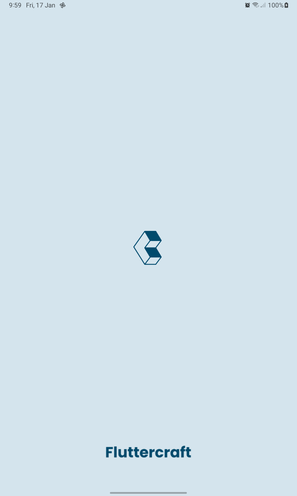
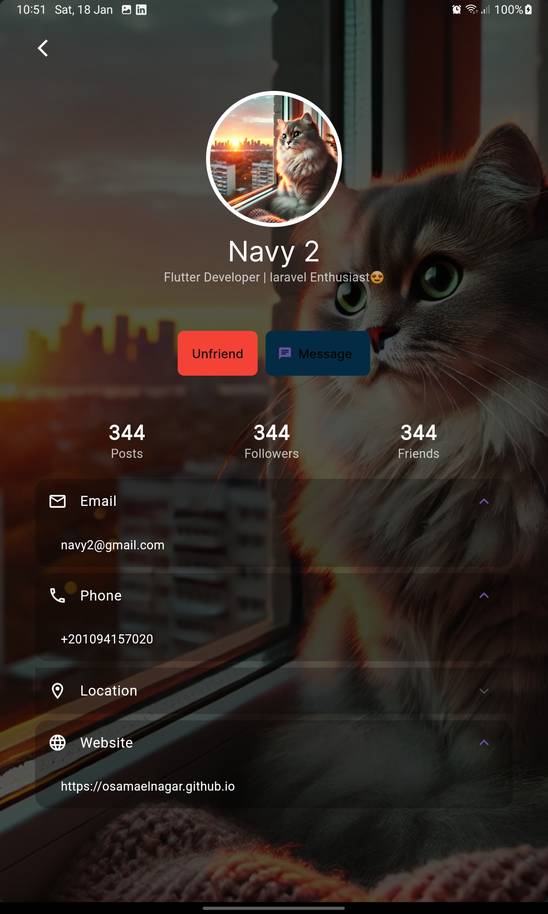
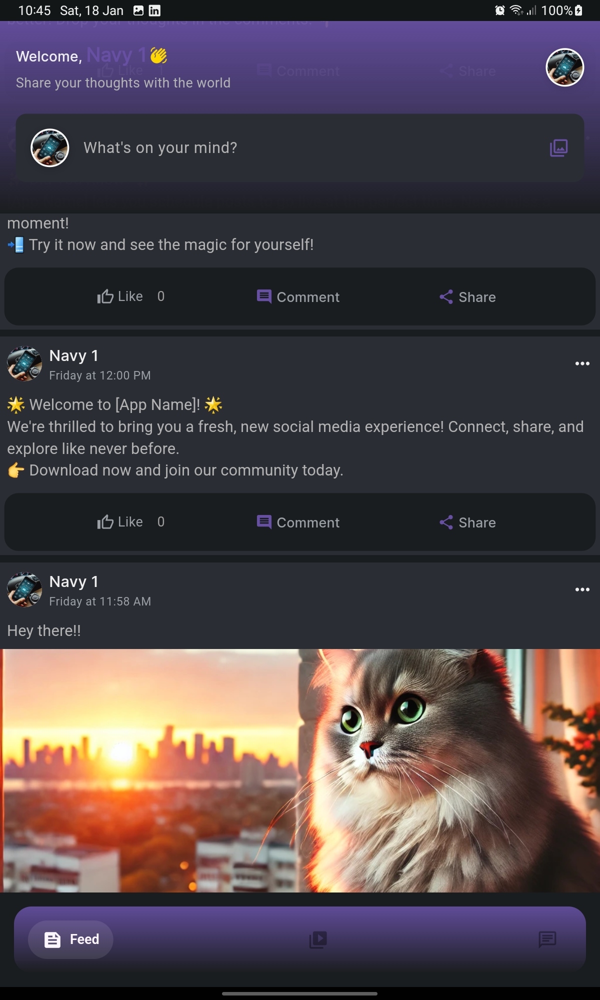

# Navy - Social Media Application

  <h1>🛍️ Navy</h1>
  
A modern social media platform, featuring real-time interactions, video sharing, and a sleek user interface. Built with Flutter & Laravel

  
  
  
  
  
  
  

[Navy App Preview](https://github.dev/OsamaElnagar/navy/blob/main/preview/Navy%20Final%20Preview%20.mp4)

## App Screenshots

  <h3>Core Screens</h3>
  

    
    
    
  

  <h3>Social Features</h3>
  

    
    
    
  

  <h3>Interactive Elements</h3>
  

    
    
    
  

  <h3>Loading States</h3>
  

    
    
  

## Features

### Core Functionality

- 📱 Cross-platform support
- 🪼 Responsive design
- 🎥 Reels/Short video support with interactive player
- 💬 Real-time chat functionality
- 🔔 Push notifications
- 🌓 Dynamic theme switching (Dark/Light mode)

### Social Features

- 👥 User profiles and authentication
- 📝 Post creation and sharing
- 🎬 Video content creation
- ❤️ Interactive reactions system
- 💭 Comments and discussions

## Technical Stack

### Frontend

- Flutter/Dart (latest)
- GetX for :

  - State management
  - Routing & navigation
  - Authorization & Middlewares
  - Localization and Helper utils

- Dio for APIs connecting with:

  - Smart retying requests on fail
  - Advanced errors handling
  - Uploading process trackingg

- Hive for local storage
- Custom animations and transitions

### Backend Integration

- Laravel 11 Framework
- MySQL DB.
- Firebase Cloud Messaging
- REST API integration
- Real-time data synchronization.

### Key Packages

- `get` - State management
- `firebase_core && firebase_messaging` - Firebase integration
- `flutter_local_notifications` - Notifications integration
- `hive && hive_flutter` - Local data persistence
- `infinite_scroll_pagination` - Smooth scrolling lists
- `animate_do`,`shimmer` and others - Animations and UI effects

## Architecture

The project follows a clean architecture pattern with:

- Feature-based structure
- Dependency injection
- Service layer abstraction
- Controller-based state management

## Contributing

Contributions are welcome! Please feel free to submit a Pull Request.

## Installation

### 1. Clone the repository

#### bash:

`git clone https://github.com/OsamaElnagar/navy.git`

### 2. Install dependencies

#### bash:

`flutter pub get`

### 3. Run the application

#### bash:

`flutter run -d {your-device-id} --release`

- run `flutter devices` to get device id

## Contact & Social Media

### Get in Touch 👋

  
  
  
  

Feel free to reach out for collaborations, questions, or just to say hi!

- 📧 **Email**: [osamaelngar98@gmail.com](mailto:osamaelngar98@gmail.com)
- 💼 **LinkedIn**: [Osama M. Elnagar](https://linkedin.com/in/osama-m-elnagar-69909018b)
- 💬 **WhatsApp**: [+20 109 415 7080](https://wa.me/+201094157080)
- 📱 **Facebook**: [Osama Elnagar](https://m.facebook.com/100039248505708/)
